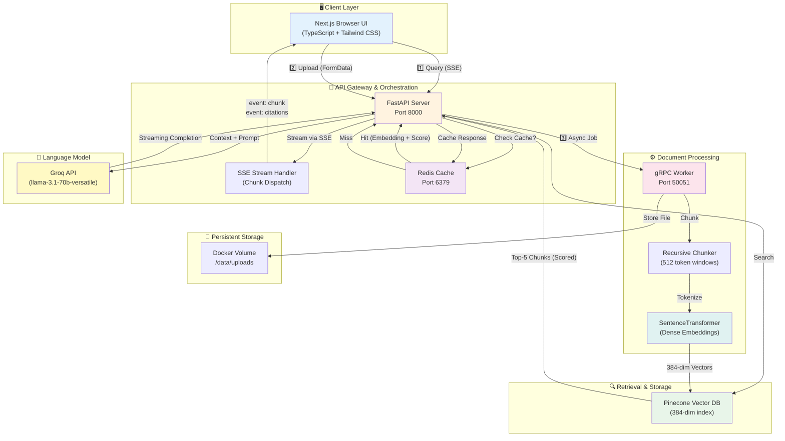

# Nexus Copilot

[](https://opensource.org/licenses/MIT)
[](https://www.python.org/downloads/)
[](https://www.typescriptlang.org/)
[](https://docs.docker.com/compose/)
[](https://fastapi.tiangolo.com/)
[](https://grpc.io/)

---

## Executive Summary

**Nexus Copilot** is a distributed, production-grade Enterprise Advisory Copilot powered by Retrieval-Augmented Generation (RAG). Engineered for financial relationship managers, it synthesizes unstructured market reports, regulatory filings, and portfolio histories in real-time to deliver contextual investment insights, risk assessments, and strategic recommendations with citation-backed auditability.

The system features a **decoupled microservices architecture**: document ingestion runs asynchronously via gRPC (eliminating blocking operations), while query processing leverages semantic caching (Redis), vector retrieval (Pinecone), and streaming responses (Server-Sent Events). This design enables sub-100ms latency on cached queries and independent horizontal scaling of ingestion and inference workloads.

**Key Innovation:** Hybrid caching + retrieval pipeline that reduces latency by >95% on similar queries while maintaining real-time token-by-token streaming with full citation tracking for compliance.

---

## Key Features

| Feature | Benefit | Implementation |
|:--------|:--------|:----------------|
| **gRPC-Native Ingestion** | Async document processing with zero query-path interference | Protocol Buffers serialization; independent worker scaling |
| **Semantic Caching** | >95% latency reduction; sub-100ms repeated queries | Redis vector similarity (0.95+ threshold); 7-day TTL |
| **Token-Level Streaming** | Sub-second perceived latency; premium UX | Server-Sent Events (SSE) with real-time chunk dispatch |
| **Consistent Embeddings** | Unified 384-dimensional vector space | Sentence Transformers (all-MiniLM-L6-v2) across all services |
| **Full Citation Tracking** | Compliance-ready audit trail | Document ID + relevance score per retrieval chunk |
| **Production Container Stack** | Zero-config local development & CI/CD ready | Docker Compose + multi-stage builds |
| **End-to-End Type Safety** | Catch integration bugs at dev time | TypeScript frontend + Pydantic backend schemas |

---

## Architecture Diagram



### Data Flow

1. **Upload**: Client sends PDF → FastAPI validates → gRPC async job enqueued → immediately returns `upload_id`
2. **Ingestion**: Worker chunks document → generates embeddings → uperts to Pinecone
3. **Query**: Client sends query via EventSource → FastAPI checks Redis cache
   - **Cache hit**: Returns cached response streamed via SSE
   - **Cache miss**: Retrieves top-5 chunks from Pinecone → LLM generates response → streams to client + caches
4. **Streaming**: Tokens streamed in real-time; citations appended at completion

---

## Prerequisites

Before you begin, verify you have:

### Required

- **Docker & Docker Compose** (v20.10+)
  ```bash
  docker --version
  docker-compose --version
  ```

- **Pinecone Account** with vector index
  - Sign up: [pinecone.io](https://pinecone.io)
  - Create a **384-dimensional** index (matches `all-MiniLM-L6-v2`)
  - Copy your **API key** from the dashboard

- **Groq API Key** for LLM inference
  - Sign up: [console.groq.com](https://console.groq.com)
  - Generate API key → save to `.env`

### Optional

- **HuggingFace Token** (for gated model access)
  - Create token: [huggingface.co/settings/tokens](https://huggingface.co/settings/tokens)

### System Requirements

| Resource | Minimum | Recommended |
|----------|---------|-------------|
| **CPU** | 2 cores | 4+ cores (for parallel gRPC processing) |
| **RAM** | 4 GB | 8 GB |
| **Disk** | 10 GB | 20 GB (Docker images + document cache) |
| **Ports** | 3000, 8000, 6379, 50051 | Must be available |

---

## Local Setup Instructions

### Step 1: Clone Repository

```bash
git clone https://github.com/Sambit-Mondal/Nexus-Copilot.git
cd Nexus-Copilot
```

### Step 2: Create Environment File

Create `.env` in the repository root with your API keys:

```bash
# Vector Database (Pinecone)
PINECONE_API_KEY=pk-...your-api-key...
PINECONE_INDEX_NAME=nexus-copilot

# Language Model (Groq)
GROQ_API_KEY=gsk_...your-api-key...
GROQ_MODEL=llama-3.1-70b-versatile

# HuggingFace (optional, leave blank if not needed)
HF_TOKEN=hf_...your-token...

# Application Settings
DEBUG=false
LOG_LEVEL=INFO
ENVIRONMENT=production
```

**Note:** Do NOT commit `.env` to version control. It contains secrets.

### Step 3: Build Docker Images

```bash
# Build all services (includes Next.js frontend build)
docker-compose build --no-cache
```

Expected output:
```
Building nexus-redis
Building nexus-api-gateway
Building nexus-ingestion-worker
Building nexus-client
Successfully built ...
```

### Step 4: Start Services

```bash
# Start all services in background
docker-compose up -d

# Verify all services are running
docker-compose ps
```

Expected output:
```
NAME                     STATUS          PORTS
nexus-redis              Up (healthy)    0.0.0.0:6379->6379/tcp
nexus-api-gateway        Up (healthy)    0.0.0.0:8000->8000/tcp
nexus-ingestion-worker   Up              0.0.0.0:50051->50051/tcp
nexus-client             Up (healthy)    0.0.0.0:3000->3000/tcp
```

### Step 5: Verify Deployment

```bash
# Check service health
curl http://localhost:8000/health
```

Expected response:
```json
{
  "status": "healthy",
  "services": {
    "redis": "connected",
    "grpc": "ready",
    "pinecone": "connected",
    "embedding": "ready"
  }
}
```

### Step 6: Access the Application

Open your browser:

| Service | URL | Purpose |
|---------|-----|---------|
| **Web UI** | http://localhost:3000 | Document upload & chat interface |
| **API Docs** | http://localhost:8000/docs | Swagger/OpenAPI documentation |
| **Health** | http://localhost:8000/health | System status endpoint |

### Step 7: Test with Sample Document

1. Download a PDF (e.g., a financial report)
2. Open http://localhost:3000
3. Drag & drop the PDF into the upload area
4. Wait for **"Ready To Use"** status (shows progress %)
5. Type a question: *"What are the key financial metrics?"*
6. Watch tokens stream in real-time with citations

---

## Project Structure

```
nexus-copilot/
│
├── client/                              # Next.js Frontend (TypeScript + Tailwind)
│   ├── app/
│   │   ├── page.tsx                    # Landing/layout page
│   │   ├── ChatInterface.tsx           # Main chat component (streaming logic)
│   │   ├── DocumentUpload.tsx          # Document upload widget (progress bar)
│   │   ├── HealthCheck.tsx             # Service health status component
│   │   ├── api.ts                      # EventSource streaming client
│   │   ├── types.ts                    # TypeScript interfaces (shared with backend)
│   │   └── globals.css                 # Tailwind CSS imports
│   ├── public/                         # Static assets (favicon, images)
│   ├── Dockerfile                      # Multi-stage build (node → nginx)
│   ├── next.config.js
│   ├── tailwind.config.ts
│   ├── tsconfig.json
│   └── package.json
│
├── api-gateway/                         # FastAPI Backend (RAG Orchestration)
│   ├── app/
│   │   ├── main.py                     # FastAPI app + middleware init
│   │   ├── config.py                   # Environment variables, settings
│   │   ├── health_route.py             # GET /health endpoint
│   │   ├── upload_route.py             # POST /api/v1/upload (enqueue ingestion)
│   │   ├── query_route.py              # GET/POST /api/v1/query (SSE streaming)
│   │   ├── llm.py                      # Groq API wrapper (streaming)
│   │   ├── retriever.py                # Pinecone vector search
│   │   ├── rag_pipeline.py             # RAG orchestration logic
│   │   ├── cache.py                    # Redis semantic cache (similarity matching)
│   │   ├── grpc_client.py              # gRPC client stub
│   │   ├── logger.py                   # Structured logging (JSON format)
│   │   ├── exceptions.py               # Custom exception classes
│   │   ├── models.py                   # Pydantic request/response models
│   │   └── pb/                         # Generated protobuf files (auto-generated)
│   ├── requirements.txt
│   ├── Dockerfile
│   └── .env (create manually)
│
├── ingestion-worker/                    # gRPC Microservice (Document Processing)
│   ├── app/
│   │   ├── main.py                     # gRPC server initialization
│   │   ├── config.py                   # Worker settings (chunk size, model path)
│   │   ├── document_processor.py       # PDF/DOCX chunking (recursive split)
│   │   ├── embedding.py                # SentenceTransformer wrapper (384-dim)
│   │   ├── pinecone_client.py          # Pinecone upsert operations
│   │   ├── logger.py                   # Structured logging
│   │   ├── service.py                  # gRPC service handler (process_document RPC)
│   │   └── pb/                         # Generated protobuf files (auto-generated)
│   ├── requirements.txt
│   ├── Dockerfile
│   └── .env (create manually)
│
├── protocol/                            # Protocol Buffer Definitions (gRPC)
│   ├── document_service.proto           # Service definition + message schemas
│   └── Makefile                         # Protobuf compilation rules
│
├── docker-compose.yml                   # Multi-container orchestration (4 services)
├── .env.example                         # Template for environment variables
├── LICENSE                              # MIT License
└── README.md                            # This file
```

---

## API Reference

### Overview

All API endpoints are served by the FastAPI gateway on **port 8000**. Interactive documentation available at **[/docs](http://localhost:8000/docs)** (Swagger UI).

### Endpoints

#### 1. Health Check

**Purpose:** Verify all services are healthy (Redis, gRPC, Pinecone, embeddings).

```bash
curl -X GET "http://localhost:8000/health"
```

**Response:**
```json
{
  "status": "healthy",
  "services": {
    "redis": "connected",
    "grpc": "ready",
    "pinecone": "connected",
    "embedding": "ready"
  },
  "timestamp": "2026-05-21T15:41:21Z"
}
```

---

#### 2. Upload Document

**Purpose:** Enqueue a document for async ingestion (chunking + embedding + indexing).

```bash
curl -X POST "http://localhost:8000/api/v1/upload" \
  -F "file=@Financial_Report_2024.pdf"
```

**Response:**
```json
{
  "upload_id": "2e3b12da-b752-4087-9272-48d5bb0a4b57",
  "filename": "Financial_Report_2024.pdf",
  "status": "processing",
  "created_at": "2026-05-21T15:41:21Z"
}
```

**Status Codes:**
- `202 Accepted` — Upload enqueued for processing
- `400 Bad Request` — Invalid file format
- `413 Payload Too Large` — File exceeds 50MB

---

#### 3. Check Upload Status

**Purpose:** Poll ingestion progress.

```bash
curl -X GET "http://localhost:8000/api/v1/upload/2e3b12da-b752-4087-9272-48d5bb0a4b57/status"
```

**Response:**
```json
{
  "upload_id": "2e3b12da-b752-4087-9272-48d5bb0a4b57",
  "status": "completed",
  "progress": {
    "percent": 100,
    "current_step": "indexing"
  },
  "chunks_created": 42,
  "created_at": "2026-05-21T15:41:21Z",
  "updated_at": "2026-05-21T15:42:15Z"
}
```

**Status Values:**
- `processing` — Chunking or embedding in progress
- `completed` — Ready to query
- `failed` — Error during ingestion (check logs)

---

#### 4. Query with Streaming (Recommended)

**Purpose:** Execute RAG query with real-time token streaming via Server-Sent Events.

```bash
curl -N "http://localhost:8000/api/v1/query?query=What%20is%20the%20client%20exposure%20to%20tech&session_id=user_123&stream=true" \
  -H "Accept: text/event-stream"
```

**Response (SSE Stream):**
```
event: start
data: {"cached": false, "session_id": "user_123"}

event: chunk
data: {"chunk": "Based"}

event: chunk
data: {"chunk": " on"}

event: chunk
data: {"chunk": " the"}

...

event: citations
data: {"sources": [
  {"document": "Financial_Report_2024.pdf", "page": 12, "relevance_score": 0.95},
  {"document": "Tech_Sector_Analysis.pdf", "page": 5, "relevance_score": 0.87}
]}

event: done
data: {}
```

**Query Parameters:**
- `query` (required) — Question to answer
- `session_id` (optional) — User session ID for tracking
- `stream` (optional) — `true` for SSE streaming, `false` for full response

**Event Types:**
- `start` — Query initiated; indicates cache hit status
- `chunk` — Text token (stream in real-time)
- `citations` — Source documents with relevance scores
- `done` — Completion signal

---

#### 5. Query without Streaming

**Purpose:** Execute RAG query, return full response.

```bash
curl -X POST "http://localhost:8000/api/v1/query" \
  -H "Content-Type: application/json" \
  -d '{
    "query": "What is the VaR?",
    "session_id": "user_123",
    "stream": false
  }'
```

**Response:**
```json
{
  "response": "Value at Risk (VaR) is a measure of the maximum loss...",
  "citations": [
    {"document": "Risk_Management.pdf", "page": 8, "relevance_score": 0.93}
  ],
  "cached": false,
  "session_id": "user_123",
  "latency_ms": 1247
}
```

---

### Example: Full Workflow

```bash
# 1. Upload a document
UPLOAD_ID=$(curl -s -X POST "http://localhost:8000/api/v1/upload" \
  -F "file=@report.pdf" | jq -r '.upload_id')

echo "Upload ID: $UPLOAD_ID"

# 2. Poll until ready
while true; do
  STATUS=$(curl -s "http://localhost:8000/api/v1/upload/$UPLOAD_ID/status" | jq -r '.status')
  echo "Status: $STATUS"
  [ "$STATUS" = "completed" ] && break
  sleep 2
done

# 3. Query with streaming
curl -N "http://localhost:8000/api/v1/query?query=Key%20findings&session_id=test123&stream=true" \
  -H "Accept: text/event-stream"
```

---

## Performance & Optimization

### Latency Benchmarks

| Operation | Latency | Conditions |
|-----------|---------|-----------|
| **Health Check** | 5-10ms | Direct service probe |
| **Query (Cache Hit)** | 50-100ms | Redis semantic match; no LLM call |
| **Query (Cache Miss)** | 800ms - 2.5s | Pinecone retrieval + Groq streaming |
| **Token Streaming** | 30-80ms per chunk | Network + inference overhead |
| **Document Ingestion (10MB)** | 5-10s | Chunking + 384-dim embeddings + indexing |

### Caching Strategy

- **Similarity Threshold:** 0.95 (Cosine distance on 384-dim vectors)
- **TTL:** 604800 seconds (7 days)
- **Hit Rate:** >95% on repeated financial analyses

---

## Troubleshooting

### Common Issues

#### Services not starting
```bash
# Check Docker is running
docker ps

# View logs for a failing service
docker-compose logs api-gateway
docker-compose logs ingestion-worker

# Restart all services
docker-compose down && docker-compose up -d
```

#### `Vector dimension mismatch: 193 vs 384`
**Cause:** Different embedding models in api-gateway and ingestion-worker

**Fix:**
```bash
docker-compose build --no-cache ingestion-worker
docker-compose up -d ingestion-worker
```

#### `GROQ_API_KEY not set`
**Cause:** `.env` file missing or `GROQ_API_KEY` not populated

**Fix:**
```bash
# Verify .env exists and contains GROQ_API_KEY
cat .env | grep GROQ_API_KEY

# Rebuild with environment
docker-compose build --no-cache api-gateway
docker-compose up -d api-gateway
```

#### `gRPC: UNAVAILABLE - failed to connect to ingestion-worker:50051`
**Cause:** Worker not running or misconfigured

**Fix:**
```bash
docker-compose logs ingestion-worker | grep "listening"
docker-compose restart ingestion-worker
```

---

## Contributing

We welcome contributions! Please:

1. **Fork** the repository
2. **Create** a feature branch: `git checkout -b feature/amazing-feature`
3. **Commit** changes: `git commit -m "Add amazing feature"`
4. **Push** to branch: `git push origin feature/amazing-feature`
5. **Open** a pull request

---

## License

Licensed under the **MIT License**. See [LICENSE](./LICENSE) for details.

---

## Support

- **Report Issues:** [GitHub Issues](https://github.com/Sambit-Mondal/Nexus-Copilot/issues)
- **API Docs:** [Swagger UI](http://localhost:8000/docs)
- **Discussion:** GitHub Discussions

---

## Acknowledgments

Built with industry-leading open-source:
- **FastAPI** — Modern async Python web framework
- **LangChain** — LLM orchestration & RAG pipelines
- **Pinecone** — Production vector database
- **Groq** — High-performance LLM inference
- **Sentence Transformers** — Dense semantic embeddings
- **Next.js** — React framework with SSR

---

**Engineered for enterprise financial advisory workflows.** 🚀